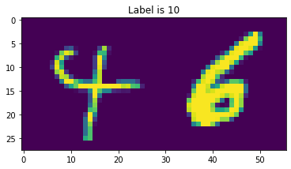
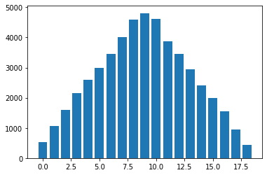
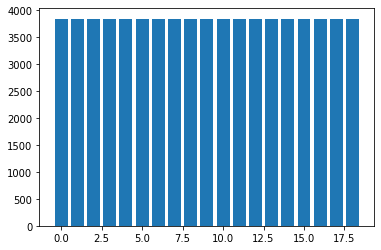
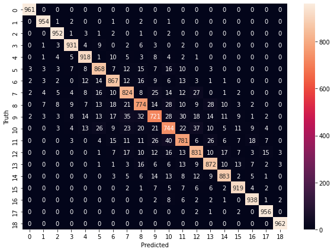
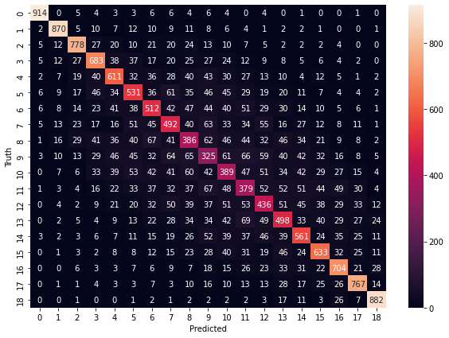
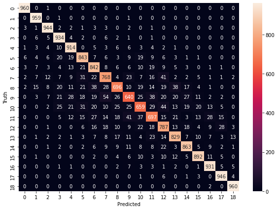
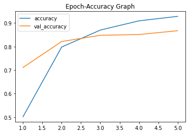
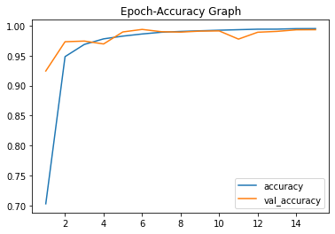

# IFT6390_Kaggle_Competition_1 - ShengHaoyue
# Info
Name:               Haoyue Sheng 
Matricule:          20239178 
Kaggle username:    shenghaoyue

# Overview
- Generate classifier to classify minist modifier image. All images are spotted from two original mnist images, and the size of the image is 56 × 28 and the label is the sum of the two mnist values, i.e. 0 to 18. 
- The logreg method requires produce from scratch
- Other methods: decision tree; random forest; Support Vector Machines; ANN; CNN.
- Attachments include all method files(jupyter notebooks) and model files, except for the random forest its model file is too large.

# contents
- Readme.md                   // help
- classification-of-mnist-digits  // dataset from the kaggle <--need additional download
- data_visualization.ipynb    
- Logreg.ipynb                // logistic regression
    - logreg0.1.json             // weight and bias for logreg
    - logreg0.01.json            // weight and bias for logreg
    - logreg3.json               // weight and bias for logreg
- TreeForest.ipynb            // decision tree; random forest
    - dtree.pickle               // model for decision tree
- SVM.ipynb                   // Support Vector Machines
    - SVM.pickle                 // model for SVM
- ANN.ipynb                   // ANN
    - ANN.h5                     // model for ANN
- CNN.ipynb                   // CNN
    - CNN.h5                     // model for CNN

# How to run
step1:
Download the dataset from the kaggle website and put the folder in the correct location as shown in the directory
    Classifying Handwritten Digits (Modified MNIST):
    https://www.kaggle.com/t/0d0b1c033ece47ffa1dbc8bd374689ae

step2:
Configure the right environment, for example: Colab (which I use)

step3:
To reproduce the project, run the following notebooks in the given order and follow the annotations:
- `Logreg.ipynb`
- `TreeForest.ipynb` 
- `SVM.ipynb` 
- `ANN.ipynb` 
- `CNN.ipynb` 

---
title: Handwritten Digits Group Classifier(Modified MNIST)
---

Name: Haoyue Sheng Kaggle username: shenghaoyue

# Introduction {#sec:intro}

Generate a classifier to classify MNIST modifier image. All images are
spotted from two original MNIST images, and the size of the image is
$56\times28$ and the label is the sum of the two MNIST values, i.e. 0 to
18. We need to use our classifier to predict an unlabeled test set and
then submit the result to Kaggle as a document.csv.

I used multiple methods to train the classifier, such as multi-class
logistic regression, and convolutional neural network (CNN). For
logistic regression, I used standardization data sets, mini-batches,
early stopping, oversampling, and reduced learning rates to improve the
performance of the classifier. in terms of results, the best score for
Kaggle using the method CNN, and the best score using the logistic
regression method is 0.214.

# Feature Design {#sec:dates}

**Select features:** In train.csv and test.csv downloaded from Kaggle,
the data set has a total of 50000 rows and 1569 columns, the missing
value in the last column is NAN. Because the pixels of the two image
MNIST is $28\times56$ equal to 1568, we only need to delete the last
column to get the required feature. In train_result.csv, the label of
the data set was saved in the second column, and the index of the first
column was not useful to us, so we delete the first column. Then,
convert one data row to an image to verify:

{width="0.5\\linewidth"} []{#fig:ex
label="fig:ex"}

**Pre-processing:** I keep 80% of the data from the data set as the
training set and the other 20% as the validation set. In order to speed
up the training and improve model performance, i used z-score
standardization: $$z = \frac{x - u}{s}$$ where:

$u$: is the mean of the sample,

$s$: is the standard deviation of the sample.

**Oversampling:** I also noticed that the distribution of our data is
not even, when the value of the label is closer to 11, the amount of
data is greater. So the number of data with values 0 and 18 is much
smaller than the data with label 11. This will have a bad effect on the
performance of the model. So in addition to the method of logistic
regression which needs to be completed from scratch, I use oversampling
to let data with all the labels have the same amount.

{width="6cm"}

{width="6cm"}

# Algorithms

-   **Multi-class logistic regression:** Considering a multi-class
    logistic regression model where $y = 0,1,2…k-1$. Weight
    $W\in \mathbb{R}^{k\times d}$ and biases $b\in \mathbb{R}^{k}$.
    Given input $X\in \mathbb{R}^{d}$, we can get a model to produce the
    possibility of each class: $y = Wx + b$.

-   **Softmax:** Use softmax to produce a probability value for each
    class of the output. Our model will predict the likelihood of each
    class, and it will output a vector of size k-1 where the d-th value
    is the likelihood of class d. And the sum of all class probabilities
    is 1.
    $$F_{softmax}(z_i) = \frac{e^{z_{i}}}{\sum_{j=1}^{K-1} e^{z_{j}}} \ \ \ for\ i=0,2,\dots,K-1$$

-   **One-hot encoding:** I used One-hot encoding because the label of
    the data is discrete and its value has no practical meaning.

-   **Cross-Entropy Loss:** The value of the loss function needs to be
    minimized to obtain the best model performance. For Softmax logistic
    regression, the cross-entropy loss function is used:
    $$L(W,b)=\mathbb{E}_{(X,Y)}[p(f(X;W,b),Y)]$$
    $$p(z,y)=-\sum_{k=0}^{K-1}1_{y=k}\log(z_{k})$$ K-1 - number of
    classes

    log - the natural log

    1 - binary indicator (0 or 1) if class label K is the correct
    classification

    z - predicted probability of class k

-   **Other ML models:** In addition to logistic regression, I also
    tried a number of different models: Support Vector Machines; Single
    Decision Tree; Random Forest; Artificial Neural Network and
    Convolutional Neural Network

# Methodology

-   **training/validation split:** Use 20% of the data set as the
    validation set. After each iteration, the program will calculate the
    loss and accuracy of the training set, then it also calculates the
    loss and accuracy of the model on the validation set, thus
    preventing overfitting.

-   **standardization of the data set:** It can noticed that the values
    in the data set are really small such as $e^{-20}$. Therefore, use
    z-score standardization to make the data set more standard, and the
    values are more naturally distributed between 0-1.

-   **Mini-Batch:** Using Mini-batch can reduce the amount of
    computation for each parameter update and speed up the descent of
    the loss function. I tried two mini-batch strategies:

    1\. Divide the training set evenly into batches of
    $dataSize/batchSize$, and in each epoch do gradient descent on each
    batch sequentially.

    2\. At each gradient descent, the mini-batch always randomly selects
    $batchSize$ data in the training set. That is, all mini-batches are
    randomly selected.

-   **Early stopping:** The function has a counter, so when the accuracy
    on the validation set does not improve after N iterations, it will
    early stop the training process.

-   **Cyclical Learning Rates:** Find the best initial learning rate by
    pretesting.

-   **Reduce learning rates:** I try to add a function that will reduce
    learning rates when the condition is reached, such as the program
    reaches the specified number of epochs, or the accuracy rate rises
    too slowly. However, the performance of the model was not improved.

# Results

-   **Logistic Regression:** The best score for the logistic regression
    algorithm is 0.2142, which is slightly better than TA's logistic
    regression baseline. After many attempts, I think it might be
    difficult to get a good performance on this data set due to the
    limited discriminate power of logistic regression. The figures on
    the next page show the results of the logistic regression model with
    different learning rates and the same batch size of 100:

    With a learning rate of 3 chosen by Cyclical Learning Rates, the
    model achieved a validation set accuracy of 0.21 in just one
    iteration. When the learning rate of 0.1 takes longer to achieve the
    same results. While the learning rate of 0.01, the process training
    was early stopped in 80 epochs because the accuracy was rising too
    slowly.

    The table below shows the accuracy obtained by all methods tried:

                **Method**            **Training time**   **Kaggle Accuracy**
      ------------------------------ ------------------- ---------------------
           Logistic regression               \-                  0.214
         Support Vector Machines             1h                  0.800
           Single Decision Tree            1min52s               0.374
              Random Forest                3min7s                0.719
        Artificial Neural Network            42s                 0.870
       Convolutional Neural Network       15min23s               0.987

-   **Support Vector Machines:** I implement the SVM classifier with the
    SVC module of sklearn. In the prepossessing step, I used
    Oversampling and z-score standardization. With set polynomial as
    kernel, the test set predicted by the SVM model got an accuracy of
    0.802 from Kaggle.

-   **Single Decision Tree:** I implement the DecisionTreeClassifier
    module from sklearn. In the prepossessing step, I used Oversampling,
    z-score standardization and used default parameter model settings.
    The test set predicted by the Decision Tree Classifier got an
    accuracy of 0.374 from Kaggle.

-   **Random Forest:** I implement the RandomForestClassifier module
    from sklearn. In the prepossessing step, I used Oversampling,
    z-score standardization and used default parameter model settings.
    The test set predicted by the Random Forest Classifier got an
    accuracy of 0.719 from Kaggle.

-   **Artificial Neural Network:** I built my ANN model using Keras
    Sequential class. The model includes an input layer, an output layer
    and two hidden layers. In the prepossessing step, I used
    Oversampling and z-score standardization. The test set predicted by
    the Random Forest Classifier got an accuracy of 0.870 from Kaggle.

-   **Convolutional neural network:** I built my CNN model using Keras
    Sequential class. The model includes an input layer, an output
    layer, three Convolution layers, three MaxPooling layers, and four
    hidden layers. In the prepossessing step, I used Oversampling and
    z-score standardization. The test set predicted by the Random Forest
    Classifier got an accuracy of 0.987 from Kaggle.

# Discussion

-   **Logistic Regression:** Logistic regression is an ML method sample
    and interpretable. It's easy to understand so it's good to implement
    from scratch. But because of its low complexity, its performance is
    also limited. And it's hard to deal with imbalanced data. In our
    Kaggle challenge, the labels of the data set are twice the original
    Mnisit data, we have 19 different labels. The number of data sets
    for each label is quite uneven. Around 10, the number of labels is
    greatly more than 0 and 19, due to when labels are around 10, there
    are more possible combinations of the two numbers like
    \[1,9\],\[2,8\],\[3,7\]\...But the closer to the 1 and 19, the fewer
    potential combinations will have. Such unevenly distributed data
    sets can negatively impact the performance of logistic regression.

    **Optimization:** (1) Use Oversampling to make data set more balance
    as in other methods. (2) We can directly replace the model and
    choose a model with higher capacity and more complexity.

-   **Other Methods:** Overall, the accuracy scores for the other
    methods I tried were greater than the logistic regression model.
    This may because to the fact that the complexity of these models is
    greater than that of logistic regression. Greater complexity means
    that the model can extract more information from the data, and the
    prediction will be more precise. Additionally, I called the SMOTE
    method from the imbalanced-learn package to Oversampling our data
    set to make the number of data for each label more even. And the
    results show that this method can effectively increase the
    performance of each model. Among all these models, Convolutional
    Neural Network (CNN) has the most complex model structure and it
    also gets the highest Kaggle score. But because of this, it is also
    more difficult to interpret, and it is very hard to tune
    hyper-parameters for optimal performance without the relevant
    knowledge. Maybe we can optimize the hyper-parameters of CNN through
    some python packages, such as Talos. ANN model is similar to CNN,
    and the difference is that it only has input layer, output layer and
    hidden layer. Support Vector Machines (SVM) get relatively high
    scores, and I find it takes a very long time to train. Maybe try
    other kernel functions or parameters to improve the speed of
    training. The random forest is a model with multiple decision trees
    that train quickly but with modest accuracy. We may improve its
    performance in the future by changing the number of decision trees
    and the maximum number of features.

# Statement of Contribution

I hereby state that all the work presented in this report is that of the
author.

# References

yawen-d, Logistic-Regression-on-MNIST-with-NumPy-from-Scratch\
<https://github.com/yawen-d/Logistic-Regression-on-MNIST-with-NumPy-from-Scratch>\
Suraj Verma, Softmax Regression in Python: Multi-class Classification,
Apr 25, 2021.\
[https://towardsdatascience.com/softmax-regression-in-python-multi-class-classification\
-3cb560d90cb2](https://towardsdatascience.com/softmax-regression-in-python-multi-class-classification-3cb560d90cb2)\
Leslie N. Smith, Cyclical Learning Rates for Training Neural Network,
2015\
[https://arxiv.org/abs/1506.01186 ](https://arxiv.org/abs/1506.01186 )\
Jason Brownlee, SMOTE for Imbalanced Classification with Python, 2020\
<https://machinelearningmastery.com/smote-oversampling-for-imbalanced-classification/>\
Muhammet Bolat, Supervised&Unsupervised Techniques on MNIST Dataset,
2020\
[https://medium.com/@muhammetbolat/supervised-unsupervised-techniques-on-mnist-dataset\
-3f2ffd4c41c5](https://medium.com/@muhammetbolat/supervised-unsupervised-techniques-on-mnist-dataset-3f2ffd4c41c5)\
Kashish, KNN vs Decision Tree vs Random Forest for handwritten digit
recognition, 2020\
[https://medium.com/analytics-vidhya/knn-vs-decision-tree-vs-random-forest-for-handwritten\
-digit-recognition-470e864c75bc
](https://medium.com/analytics-vidhya/knn-vs-decision-tree-vs-random-forest-for-handwritten-digit-recognition-470e864c75bc )

\

# Appendix

-   **Results logistic regression loss :**

-   **Confusion matrix SVM :**

    {width="0.8\\linewidth"} []{#fig:ex
    label="fig:ex"}

-   **Confusion matrix Single Decision Tree :**

    {width="0.65\\linewidth"} []{#fig:ex
    label="fig:ex"}

-   **Confusion matrix Random Forest :**

    {width="0.65\\linewidth"} []{#fig:ex
    label="fig:ex"}

-   **Artificial Neural Network :**

    {width="0.5\\linewidth"} []{#fig:ex
    label="fig:ex"}

-   **Convolutional Neural Network :**

    {width="0.5\\linewidth"} []{#fig:ex
    label="fig:ex"}
